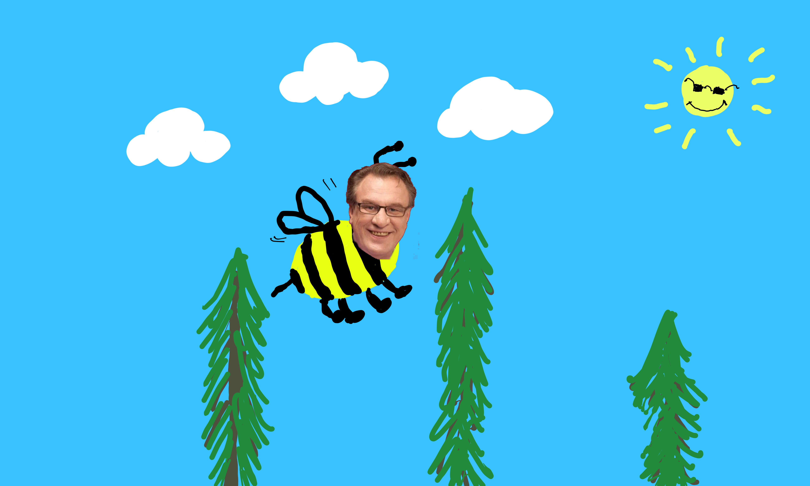

# Harjoitustyön suunnitelma

## Tietoja 

Tekijä: Lempi Leinonen

Työ git-varaston osoite: <https://github.com/leinonle/ohj1ht>

Pelin nimi: Izmo Mehiläinen

Pelialusta: Windows

Pelaajien lukumäärä: 1

## Pelin tarina

Ismo Laitela joutuu polttareissaan pukeutumaan mehiläiseksi. Kaverit lähettävät hänet kaupungille tehtävällä: kerää rahaa aviokassaan ja väistele esteitä, muuten häät jää pitämättä. Jokainen kolikko ja seteli vie Ismoa lähemmäs unelmahäitä – mutta pylväät, johdot ja muut kommellukset tekevät matkasta kaikkea muuta kuin helpon.

## Pelin idea ja tavoitteet

Flappy bird klooni, jossa kerätään kolikoita, joista saa pisteitä.
Peli jatkuu kunnes pelaaja osuu tolppaan/esteeseen.

## Hahmotelma pelistä

## Toteutuksen suunnitelma

### Oliot

- Hahmo
    - Tarkoitus
        - Pelaaja hahmo, joka liikkuu pystysuunnassa.
        - Tunnistaa osumat esteisiin, jolloin peli loppuu
        - Tippuu kokoajan alaspäin ja hyppää esim. välilyönnillä
    - Muuttujat
        - SoundEffect hyppyÄäni
        - SoundEffect törmäysÄäni
        - double painovoima
        - double hyppyvoima
        - int pisteet
        - Image tekstuuri
    - Funktiot
        - void hyppy()
        - void soitaÄäni(? ääni)
        - void törmäys(Este törmäysKohde)

- Tausta (perii PhysicsObject) Done
    - Tarkoitus
        - Tausta elementit liikkuvat vasemmalle luoden illuusion pelaajan liikkeestä
        - Kun tausta poistuu näkymästä vasemmalle, se poistetaan
    - Muuttujat
        - double liikenopeus
        - Image tekstuuri
    - Funktiot
        - bool tarkistaNäkyvyys()

- Este (perii Tausta)
    - Tarkoitus
        - Perii tausta olion ominaisuudet erona se, että pelaaja tunnistaa osuman esteeseen
        - Kun pelaaja osuu esteeseen, niin tarkistetaan, onko este kuolettava -> Game over
    - Muuttujat
        - ? törmäysAlue
        - bool onkoKuolettava

- Kerättävä (perii Este)
    - Tarkoitus
        - Perii esteen ja ylikirjoittaa sen onkoKuolettava arvon falsella
        - Kerättävällä on lisänä esteeseen tuhoutuminen, kun se osuu pelaajaan, jolloin se soittaa myös äänen
    - Muuttujat
        - SoundEffect keräysÄäni
    - Funktiot
        - void tuhoutuminen()
        - void soitaÄäni()

- Maailmanrajat
    - Tarkoitus
        - ylä- ja alarajat, jotka estävät pelaajan poistumisen pelikentältä
        - Alaraja on kuolettava eli peli loppuu, jos pelaaja osuu siihen
        - Periaatteessa voisi käyttää este luokkaa asettamalle nopeudeksi 0
    - Muuttujat
        - ? törmäysAlue
        - bool onkoKuolettava

- Maailmanluoja
    - Tarkoitus
        - Randomilla määrittää tietyn väliajan välein, mitä esteitä ja ympäristö olioita se peliin maailman oikeaan laitaan
    - Muuttujat
        - double koristeTiheys
        - double esteTiheys
        - double pisteTiheys
        - double liikeNopeus
    - Funktiot
        - void luoEste()    // Luo esteen radnom y-koordinaattiin kentän oikeaan reunaan
        - void luoPiste()   // Nämä kolem voisi yhdistää niin, että ottaisi parametrinä luotavan olion tyypin
        - void luoKoriste()
        - void maailmaArpoja()  // Silmukalla käyttää noita edellä mainittuja funktioita satunnaisella aikavälillä.

27.10.2025 mennessä

- Pelaaja hahmon luonti
- Este ja piste oliot, jotka voi käsin lisätä peli maailmaan.

28.11.2025 mennessä

- Maailmanluoja olio, joka luo randomilla esteet ja pisteet maailmaan
- Joku aloitus ja game over näkymä

Jos aikaa jää

- Eri piste tyyppejä ja ehkä powerupit

